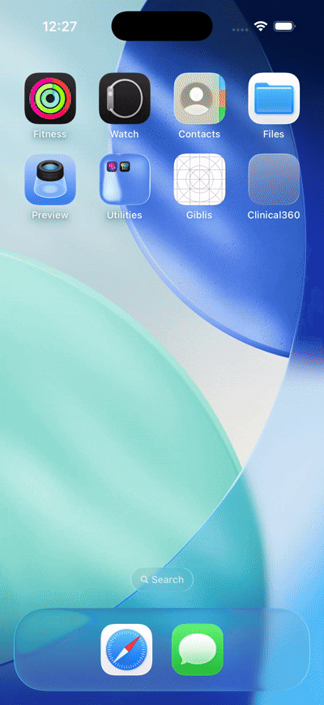

# Clinical360

Clinical360 is an iOS SwiftUI application built to demonstrate a clean, modular clinical workflow for patient management, detail viewing, and report previewing.

## 🎥 Demo Preview

An auto-playing GIF preview is included in the repository root.

- GIF file name: `Clinical360.gif`
- Use this as the autoplay preview in the README

## 📌 Overview

Clinical360 is designed as a clinical companion app that lets users:
- browse a list of patients
- open detailed patient information
- view and download patient reports
- preview downloaded report files

The app uses a clean architecture approach with a coordinator-driven navigation flow and dependency injection.

## 🚀 Key Features

- Patient list with loading, empty, and error states
- Patient detail screen with care team and clinical information
- Patient reports list with download and preview support
- Centralized coordinator for navigation using `NavigationStack`
- Separation of concerns using repositories, use cases, view models, and scenes

## 🏗 Architecture

Clinical360 is structured around clean architecture principles:

- `AppDependencies`
  - Central dependency container for shared services such as `ApiClient` and `DownloadManger`
- `AppCoordinator`
  - Owns app navigation and root view creation
  - Manages `NavigationPath` and route-based destination creation
- `Features/*`
  - `Scene` builds the view and its dependencies
  - `ViewModel` handles state and business flow
  - `UseCase` encapsulates feature business rules
  - `Repository` handles networking and persistence
- `Model`
  - Shared data models such as `PatientRecord` and report types
- `Network`
  - API client, requests, endpoints, and error handling
- `Utility`
  - Shared UI components such as loading, empty state, error state, and preview helpers

## 📁 Project Structure

- `Clinical360/App/Clinical360App.swift`
  - App entry point
- `Clinical360/App/AppDependencies.swift`
  - Shared dependency container
- `Clinical360/Coordinator/Coordinator.swift`
  - Navigation and routing logic
- `Clinical360/Features/PatientList/`
  - Patient list feature module
- `Clinical360/Features/PatientDetail/`
  - Patient detail feature module
- `Clinical360/Features/PatientReports/`
  - Patient reports feature module
- `Clinical360/Model/`
  - Domain and response models
- `Clinical360/Network/`
  - API client implementations and request logic
- `Clinical360/Utility/`
  - Common reusable views and helpers

## 🔧 How It Works

1. `Clinical360App` creates `AppCoordinator`
2. `AppCoordinator.makeRootView()` creates the initial patient list feature
3. `PatientListView` uses the coordinator to navigate to detail screens
4. `AppCoordinator.makeDestination(for:)` resolves routes into destination views
5. Each feature uses a repository + use case + view model stack for clean separation

## 🧪 Running the App

- Open `Clinical360/Clinical360.xcodeproj`
- Select the `Clinical360` target
- Run on a simulator or device

## 💡 Notes

- The app is built using SwiftUI and modern Swift concurrency patterns
- Navigation is handled in one place by the coordinator for easier feature extension
- Feature modules are isolated so new screens can be added without impacting existing flows

---